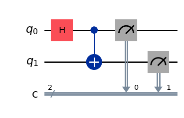
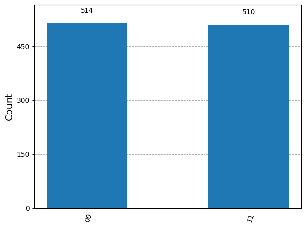
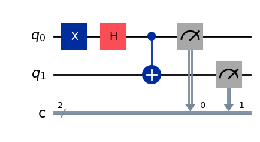
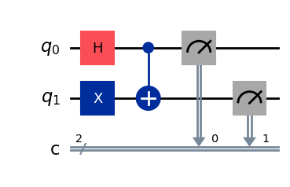
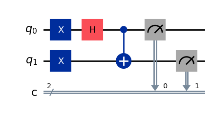

# The Four Bell States: Complete Implementation

This folder contains the source code and visual results for all four **Bell States**. These states represent the maximum entanglement between two qubits and form a basis for quantum information theory.

## Overview
Each state is generated by a specific combination of Hadamard ($H$), Pauli-X ($X$), and CNOT gates. Below, you can find the circuit and the resulting measurement histogram for each case.

---

## 1. First Bell State $|\Phi^+\rangle$
**Equation:** $|\Phi^+\rangle = \frac{|00\rangle + |11\rangle}{\sqrt{2}}$  
**Code:** [`FirstBellState.py`](./FirstBellState.py)

| Circuit | Histogram |
| :---: | :---: |
|  |  |

---

## 2. Second Bell State $|\Phi^-\rangle$
**Equation:** $|\Phi^-\rangle = \frac{|00\rangle - |11\rangle}{\sqrt{2}}$  
**Code:** [`SecondBellState.py`](./SecondBellState.py)

| Circuit | Histogram |
| :---: | :---: |
|  |  |

---

## 3. Third Bell State $|\Psi^+\rangle$
**Equation:** $|\Psi^+\rangle = \frac{|01\rangle + |10\rangle}{\sqrt{2}}$  
**Code:** [`ThirdBellState.py`](./ThirdBellState.py)

| Circuit | Histogram |
| :---: | :---: |
|  |  |

---

## 4. Fourth Bell State $|\Psi^-\rangle$
**Equation:** $|\Psi^-\rangle = \frac{|01\rangle - |10\rangle}{\sqrt{2}}$  
**Code:** [`FourthBellState.py`](./FourthBellState.py)

| Circuit | Histogram |
| :---: | :---: |
|  |  |

---

## Technical Details
* **Framework:** Qiskit
* **Simulation:** `qasm_simulator` with 1024 shots.
* **Purpose:** Expository material for Undergraduate Research (IC).

> **Note:** For deep theoretical analysis, please refer to the main repository documentation. To interact with the code and change parameters, use the **Google Colab** link at the top.