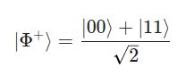

# The Bell State: A Guide to Quantum Entanglement

The Bell state algorithm is the "Hello World" of quantum computing. Its purpose is to create entanglement - a phenomenon where two qubits become so deeply linked that the state of one instantly determines the state of the other, regardless of the distance between them.

We want to reach a specific quantum state, most commonly the ∣Φ+⟩ state:
