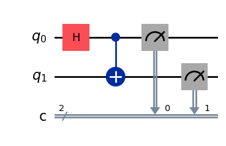
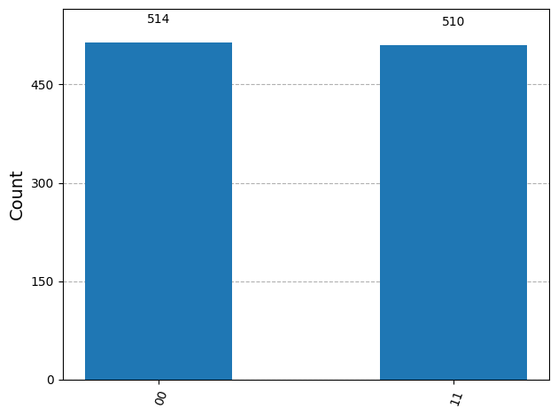
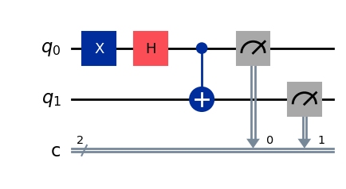
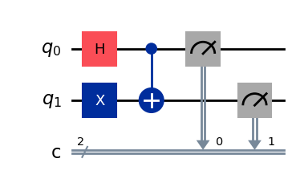
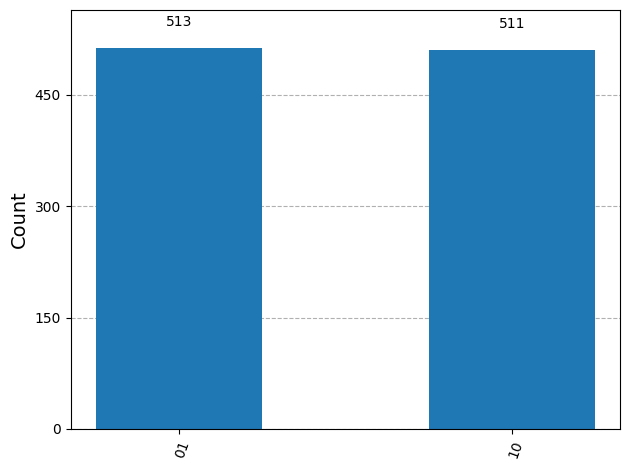
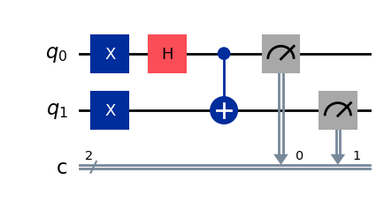
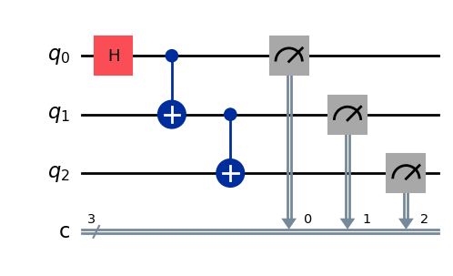
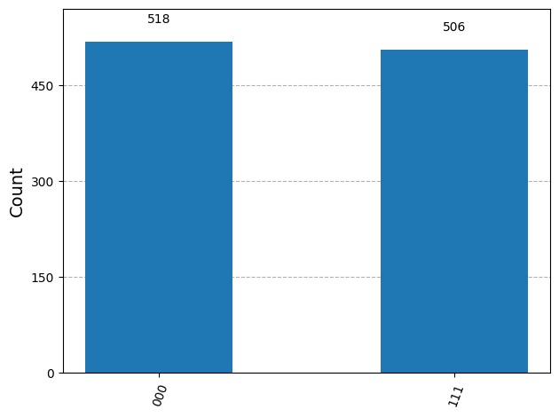
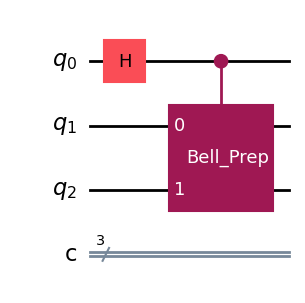
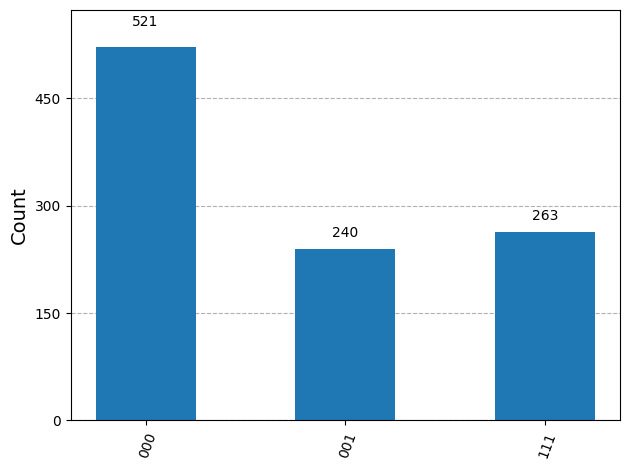

# Entanglement & Bell States: Complete Implementation

This folder contains the source code and visual results for fundamental and advanced quantum entanglement concepts, from the four **Bell States** to multipartite entanglement and tests of local realism.

## Overview
The implementations explore how Hadamard ($H$), Pauli-X ($X$), and CNOT gates can be orchestrated to create strong quantum correlations. Below, you will find the circuits, histograms, and technical explanations for each case.

---

## 1. First Bell State $|\Phi^+\rangle$
**Equation:** $|\Phi^+\rangle = \frac{|00\rangle + |11\rangle}{\sqrt{2}}$  
**Code:** [`FirstBellState.py`](./FirstBellState.py)

| Circuit | Histogram |
| :---: | :---: |
|  |  |

---

## 2. Second Bell State $|\Phi^-\rangle$
**Equation:** $|\Phi^-\rangle = \frac{|00\rangle - |11\rangle}{\sqrt{2}}$  
**Code:** [`SecondBellState.py`](./SecondBellState.py)

| Circuit | Histogram |
| :---: | :---: |
|  |  |

---

## 3. Third Bell State $|\Psi^+\rangle$
**Equation:** $|\Psi^+\rangle = \frac{|01\rangle + |10\rangle}{\sqrt{2}}$  
**Code:** [`ThirdBellState.py`](./ThirdBellState.py)

| Circuit | Histogram |
| :---: | :---: |
|  |  |

---

## 4. Fourth Bell State $|\Psi^-\rangle$
**Equation:** $|\Psi^-\rangle = \frac{|01\rangle - |10\rangle}{\sqrt{2}}$  
**Code:** [`FourthBellState.py`](./FourthBellState.py)

| Circuit | Histogram |
| :---: | :---: |
|  |  |

---

## 5. Multipartite Entanglement: GHZ State
**Equation:** $|GHZ\rangle = \frac{|000\rangle + |111\rangle}{\sqrt{2}}$  
**Code:** [`GHZState.py`](./GHZState.py)

Extending entanglement to 3 qubits. Measuring any single qubit instantly dictates the state of the other two, collapsing exclusively to $|000\rangle$ or $|111\rangle$.

| Circuit | Histogram |
| :---: | :---: |
|  |  |

---

## 6. Quantum Sub-routines: Controlled Bell State
**Code:** [`ControlledBell.py`](./ControlledBell.py)

Demonstrates how to abstract the Bell State preparation into a custom gate and apply it conditionally using a control qubit (a "quantum if-statement"). If the control is $|1\rangle$, the target qubits become entangled.

| Abstract Circuit | Output Histogram |
| :---: | :---: |
|  |  |

---

## 7. Proving Non-Locality: CHSH Inequality
**Code:** [`CHSH_Inequality.py`](./CHSH_Inequality.py)

A programmatic simulation of the CHSH test (a generalized Bell's Theorem). By rotating Alice and Bob's measurement bases to specific angles, the simulation consistently yields a parameter $S > 2$ (typically around $2.82$), violating the classical limit and proving that the correlations are genuinely quantum.

---

## Technical Details
* **Framework:** Qiskit
* **Simulation:** `qasm_simulator` (AerSimulator)
* **Purpose:** Expository material for Undergraduate Research (IC).

> **Note:** For deep theoretical analysis, please refer to the main repository documentation. To interact with the code and change parameters, use the **Google Colab** link at the top.
