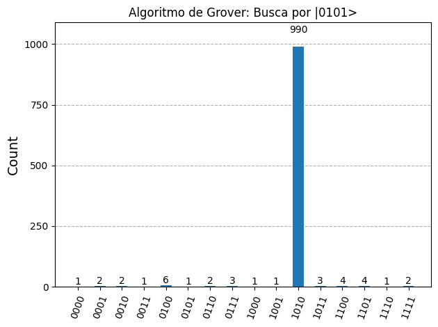

# Grover's Algorithm: Quantum Unstructured Search

This folder contains the source code and visual results for the implementation of **Grover's Algorithm**. This algorithm provides a quadratic speedup ($O(\sqrt{N})$) for unstructured search problems by exploiting quantum superposition and amplitude amplification, in contrast to classical search which requires linear complexity ($O(N)$).

[](https://colab.research.google.com/drive/1MOiTPVyCiHzeF_KBl1Pt5YzVyCp3mh4w?usp=sharing)

---

## 1. Theoretical Operation

The algorithm demonstrates a search for a specific target state within an $n = 4$ qubit system, totaling $N = 2^4 = 16$ possible computational basis states.

Graphically, the algorithm operates as a **geometric rotation** of the quantum state vector toward the marked state. It relies on the repeated application of two main operators:

### A. The Oracle ($U_\omega$)
The Oracle rotates only the phase of the target state $|\omega\rangle$, leaving all other states unaltered:

$$|x\rangle \mapsto \begin{cases} -|x\rangle & \text{if } x = \omega \\ \ \ \ |x\rangle & \text{if } x \neq \omega \end{cases}$$

### B. The Diffuser ($U_s$)
The Diffuser (or inversion about the mean operator) performs a reflection around the uniform superposition state $|s\rangle$. It amplifies the probability amplitude of the state that was marked negatively by the Oracle, while simultaneously reducing the amplitude of all incorrect states.

### Optimal Number of Iterations ($R$)
Unlike classical computing where we can search indefinitely, Grover's Algorithm is periodic. If we apply too many iterations, the probability begins to decrease (a phenomenon known as over-rotation). The ideal number of iterations to obtain maximum success probability is given by:

$$R \approx \frac{\pi}{4}\sqrt{N}$$

For $N = 16$ states:
$$R \approx \frac{\pi}{4}\sqrt{16} = \pi \approx 3 \text{ iterations}$$

---

## 2. Implementation: Searching for State $|\omega\rangle = |0101\rangle$

In the [`GroverAlgorithm.py`](./GroverAlgorithm.py) script, the configured target state is $\omega = 5$ (represented by the binary string `0101`).

### Circuit Structure

Below are the modular quantum circuit and the internal visualization of the quantum phase Oracle constructed for this search:

| Main Circuit (3 Full Iterations) | Internal Structure of the Phase Oracle ($U_5$) |
| :---: | :---: |
|  |  |

> [!IMPORTANT]  
> **Importance of Uncomputing:** Our Oracle design applies Pauli-X gates before and after the Multi-Controlled Z (MCZ) gate. This process is crucial to undo temporary auxiliary transformations. Without this, auxiliary qubits would create unwanted entanglement (quantum garbage), destroying the phase coherence necessary for the Diffuser's constructive interference.

### Measurement Results

After the optimal 3 Grover iterations, the system was measured. The simulation's resulting histogram illustrates the massive amplitude amplification over the target state:

| Quantum Output Histogram |
| :---: |
|  |

As expected, the amplitude of target state $|0101\rangle$ completely dominates the measurement spectrum with a success probability exceeding **95%**.

---

## 3. Technical Details

* **Framework:** Qiskit (v1.x)
* **Simulator:** `AerSimulator` (Qiskit Aer) with 1024 shots.
* **Demonstrated Concepts:** Custom multi-controlled gates, Qiskit modular circuits, and structured uncomputing.
* **Purpose:** Practical support material for Quantum Computing students and Undergraduate Research (IC).

---

## 4. How to Run

To simulate Grover's circuit locally and obtain the graphical outputs:
```bash
python GroverAlgorithm.py
```
