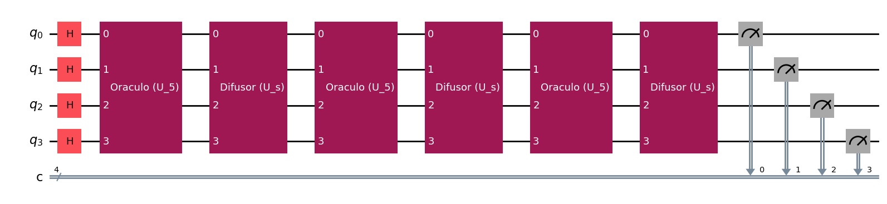
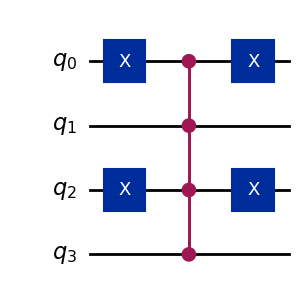

# Grover's Algorithm: Quantum Search Implementation

This folder contains the source code and visual results for the implementation of **Grover's Algorithm**. This algorithm provides a quadratic speedup for unstructured search problems by exploiting quantum superposition and amplitude amplification.

## Overview
The implemented circuit demonstrates a search for a specific target state within a 4-qubit system ($N = 2^4 = 16$ possible states). 

The algorithm relies on two main geometric reflections:
1. **The Oracle ($U_\omega$):** A conditional phase-flip operation that marks the target state.
2. **The Diffuser ($U_s$):** A Householder reflection about the mean, which amplifies the probability amplitude of the marked state.

---

## Implementation: Searching for $|\omega\rangle = |0101\rangle$

In this specific implementation, the target state is $\omega = 5$ (binary `0101`). For a 4-qubit system, the optimal number of Grover iterations to maximize the probability of success is $R \approx \lfloor \frac{\pi}{4}\sqrt{16} \rfloor = 3$ iterations.

**Target State:** $|0101\rangle$  
**Code:** [`GroverAlgorithm.py`](./GroverAlgorithm.py)

### Circuit Structure

| Main Circuit (Modular Abstraction) | Oracle Internal Structure ($U_5$) |
| :---: | :---: |
|  |  |

> **Note on Uncomputing:** The Oracle design includes proper uncomputing (applying $X$ gates before and after the Multi-Controlled Z gate) to ensure auxiliary operations do not create garbage entanglement, which would destroy the interference pattern.

### Measurement Results

| Output Histogram |
| :---: |
|  |

After 3 iterations, the amplitude of the state $|0101\rangle$ is successfully amplified, dominating the measurement probabilities (typically > 95%).

---

## Technical Details
* **Framework:** Qiskit
* **Simulation:** `qasm_simulator` (AerSimulator) with 1024 shots.
* **Algorithm Components:** Custom Multi-Controlled Z gates, modular sub-circuit appending, and explicit uncomputing.
* **Purpose:** Expository material and practical implementation for Undergraduate Research (IC).
