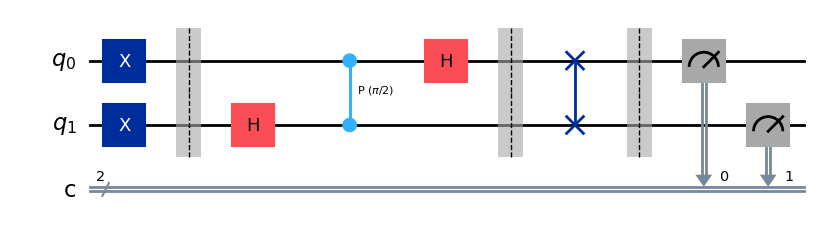
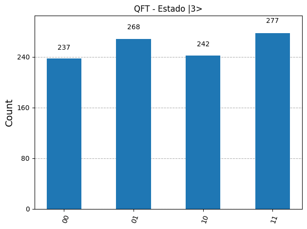

# Quantum Fourier Transform (QFT)

This folder contains the implementation of the **Quantum Fourier Transform (QFT)**, a fundamental sub-routine for several prominent quantum algorithms, such as Shor's Algorithm (factoring) and Quantum Phase Estimation (QPE).

[](https://colab.research.google.com/drive/1MOiTPVyCiHzeF_KBl1Pt5YzVyCp3mh4w?usp=sharing)

---

## 1. Mathematical Foundations

The QFT performs a linear transformation on qubits that maps the computational basis (classical amplitude states) into the Fourier basis (phase states). Mathematically, the QFT acts on an $n$-qubit basis state $|j\rangle$ (where $N = 2^n$) as follows:

$$|j\rangle \mapsto \frac{1}{\sqrt{N}} \sum_{k=0}^{N-1} \omega^{j k} |k\rangle$$

Where $\omega$ is the $N$-th root of unity:
$$\omega = e^{\frac{2\pi i}{N}}$$

### Product State Decomposition
For implementation in circuits, the QFT can be written extremely elegantly as a tensor product of single-qubit states:

$$|j_1 j_2 \dots j_n\rangle \mapsto \frac{1}{\sqrt{2^n}} \left(|0\rangle + e^{2\pi i 0.j_n}|1\rangle\right) \otimes \left(|0\rangle + e^{2\pi i 0.j_{n-1}j_n}|1\rangle\right) \otimes \dots \otimes \left(|0\rangle + e^{2\pi i 0.j_1j_2\dots j_n}|1\rangle\right)$$

Where the binary fractional notation $0.j_1 j_2 \dots j_n$ represents:
$$0.j_1 j_2 \dots j_n = \sum_{l=1}^{n} j_l 2^{-l}$$

> [!NOTE]  
> Note that each qubit is placed into an equal superposition of $|0\rangle$ and $|1\rangle$, but with a relative phase that depends on the value of the original state in the computational basis.

---

## 2. Implementation and Results

In the [`QFT_Algorithm.py`](./QFT_Algorithm.py) script, we test the QFT by applying it to the initial quantum state $|3\rangle$ (which in 2-qubit binary is $|11\rangle$, i.e., both qubits initialized to $|1\rangle$ using Pauli-X gates).

Below are the generated quantum circuit and the simulation's resulting histogram:

| Quantum Circuit Structure | Measurement Histogram (Phase and Distribution) |
| :---: | :---: |
|  |  |

---

## 3. Technical Implementation Details

The circuit was built recursively and modularly in the [`QFT_Algorithm.py`](./QFT_Algorithm.py) file, split into two fundamental steps:

### A. Controlled Phase Rotations (`qft_rotations`)
For each qubit $n$, we apply:
1. A Hadamard ($H$) gate to create the initial superposition.
2. Controlled fractional Phase gates ($CP(\theta)$ or $R_k$) with the remaining qubits in the register, where the rotation angle is given by:
   $$\theta = \frac{\pi}{2^{n - \text{qubit}}}$$

### B. Geometric Correction (`swap_qubits`)
When expanding the QFT product state equation, the phase coefficients result in an inverted order relative to the physical qubit indices (a phenomenon known as **Bit-Reversal**).

To correct this inversion and ensure that the most significant qubit corresponds to the correct output, we apply `SWAP` gates crossing the ends of the register (first with last, second with second-to-last, etc.):

```python
def swap_qubits(circuit, n):
    """Corrects qubit order (Bit-Reversal)."""
    for qubit in range(n // 2):
        circuit.swap(qubit, n - qubit - 1)
    return circuit
```

> [!IMPORTANT]  
> Without `SWAP` gates at the end of the circuit, the quantum representation would be "mirrored", causing any subsequent algorithm (such as QPE or Shor) to fail due to reading phase fractions backwards.

---

## 4. Requirements and Execution

* **Framework:** Qiskit (v1.x)
* **Simulator:** `AerSimulator` (Qiskit Aer)
* **Visualization:** Matplotlib with `iqp` style (IBM Quantum default style)

To run locally and see the graphical output:
```bash
python QFT_Algorithm.py
```