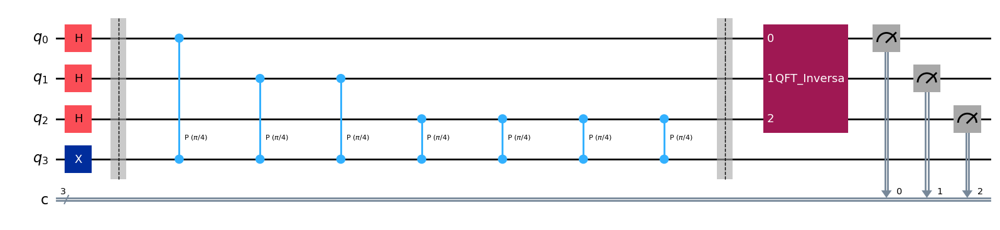
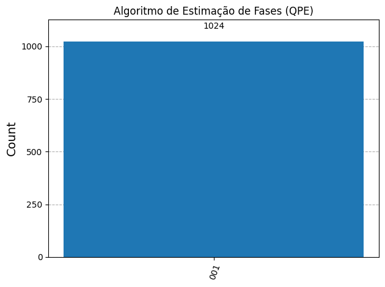

# Quantum Phase Estimation (QPE)

This folder contains the implementation of the **Quantum Phase Estimation (QPE)** algorithm. This algorithm acts as a vital bridge between abstract phase manipulation and measurable classical data, serving as the foundation for Shor's Algorithm and quantum chemistry simulations (algorithms based on Hamiltonian simulation).

[](https://colab.research.google.com/drive/1MOiTPVyCiHzeF_KBl1Pt5YzVyCp3mh4w?usp=sharing)

---

## 1. Theoretical Foundations

Given a unitary operator $U$ and its corresponding eigenvector $|\psi\rangle$, the quantum eigenvalue relationship is defined as:

$$U |\psi\rangle = e^{2\pi i \theta} |\psi\rangle$$

Where $\theta \in [0, 1)$ is the secret phase we want to estimate. The QPE algorithm utilizes two qubit registers:
1. **Readout Register (Controls):** Contains $t$ qubits initialized to $|0\rangle$, which will be placed in superposition and store the phase in binary decimal format.
2. **Target Register:** Initialized in the quantum eigenvector $|\psi\rangle$.

### A. The Phase Kickback Mechanism
By applying a controlled $U^{2^j}$ gate where readout qubit $j$ is the control and the target register is $|\psi\rangle$, the extracted phase is "kicked back" to the control qubit, without altering the target's state:

$$|0\rangle|\psi\rangle + |1\rangle U^{2^j}|\psi\rangle = \left(|0\rangle + e^{2\pi i 2^j \theta}|1\rangle\right)|\psi\rangle$$

After applying this procedure for all $t$ control qubits with successive powers of $U$ ($U^1, U^2, U^4, \dots, U^{2^{t-1}}$), the control register reaches the state:

$$|\Psi_{cont}\rangle = \frac{1}{\sqrt{2^t}} \sum_{k=0}^{2^t-1} e^{2\pi i \theta k} |k\rangle$$

> [!NOTE]  
> This state is exactly the Fourier domain representation of the phase $\theta$!

### B. Decoding with Inverse QFT ($QFT^\dagger$)
To bring the phase information back to measurable classical amplitudes, we apply the **Inverse Quantum Fourier Transform ($QFT^\dagger$)**. If the phase can be represented exactly with $t$ bits of precision, the final measurement will deterministically return the corresponding integer state:

$$|2^t \theta\rangle$$

---

## 2. Implementation and Results

In the [`QPE_Algorithm.py`](./QPE_Algorithm.py) script, we implement a system with:
* **$t = 3$ readout qubits** in the control register (allowing phase estimation with up to $1/2^3 = 1/8 = 0.125$ precision).
* **1 target qubit** initialized to eigenvector $|1\rangle$ (via a Pauli-X gate).
* **Secret Phase $\theta = 1/8$** ($0.125$) applied via controlled phase rotations $CP(\theta)$ with angle:
  $$\phi = 2\pi\theta = \frac{\pi}{4}$$

Since the target is in the state $|1\rangle$, it acts as the eigenvector of the phase operator $P(\phi)$ with eigenvalue $e^{i\phi} = e^{2\pi i (1/8)}$.

Below are the generated quantum circuit and the simulation's resulting histogram:

| Quantum Circuit Structure (QPE) | Measurement Histogram of the Estimated Phase |
| :---: | :---: |
|  |  |

### Results Analysis
The final measurement yields 100% probability in the state **`001`** (equivalent to decimal integer $1$).
Calculating the estimated phase:

$$\theta_{estimated} = \frac{\text{Measured Value}}{2^t} = \frac{1}{2^3} = \frac{1}{8} = 0.125$$

The result is **absolutely exact**, demonstrating the flawless performance of the estimation algorithm.

---

## 3. Code Structure

The [`QPE_Algorithm.py`](./QPE_Algorithm.py) file follows a clear development order:

1. **Parameter Definition:** Configuration of the target phase $\theta = 0.125$ and number of readout qubits $t=3$.
2. **Initialization:** Application of Hadamard gates to all control qubits and an $X$ gate on the target qubit.
3. **Cascades of Controlled Operations:** Structured loops to apply $U^{2^j}$ in a staggered manner:
   ```python
   repetitions = 1
   for counting_qubit in range(t):
       for i in range(repetitions):
           qc.cp(angle, counting_qubit, t)
       repetitions *= 2
   ```
4. **Inverse QFT Coupling:** Utilizing Qiskit's native library to efficiently append the $QFT^\dagger$ gate:
   ```python
   qft_inverse = QFT(num_qubits=t, inverse=True, do_swaps=True).to_gate()
   qft_inverse.name = "Inverse QFT"
   qc.append(qft_inverse, range(t))
   ```
5. **Measurement and Plot:** Execution on the `AerSimulator` and graphical display of results.

---

## 4. Requirements and Execution

* **Framework:** Qiskit (v1.x)
* **Simulator:** `AerSimulator` (Qiskit Aer)
* **Visualization:** Matplotlib with `iqp` style (IBM Quantum default style)

To run locally and see the graphical output:
```bash
python QPE_Algorithm.py
```